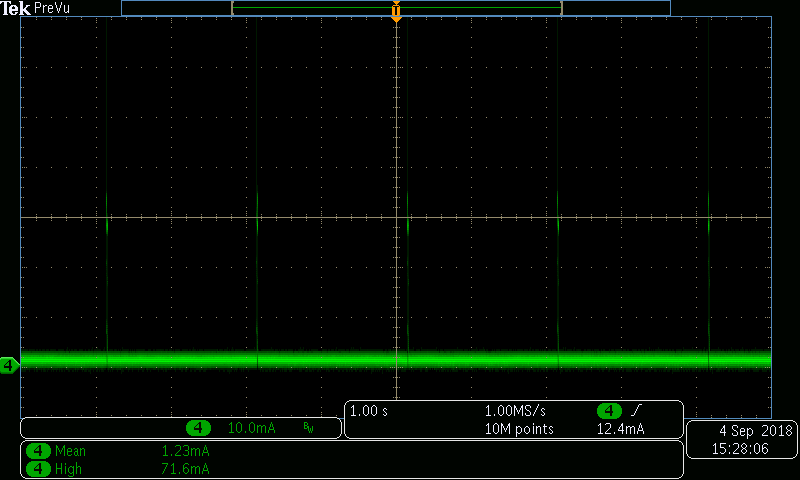
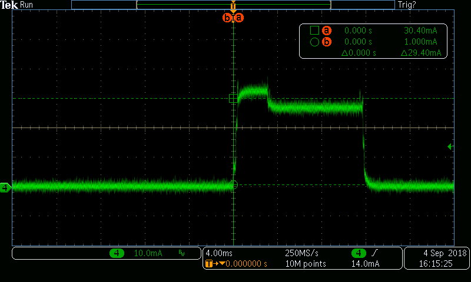

# Light Sleep Example

(See the README.md file in the upper level 'examples' directory for more information about examples.)

This example illustrates usage of light sleep mode. Unlike deep sleep mode, light sleep preserves the state of the memory, CPU, and peripherals. Execution of code on both CPUs is stopped when `esp_light_sleep_start()` function is called. When the chip exits light sleep mode, execution continues at the point where it was stopped, and `esp_light_sleep_start()` function returns.

The example enables the following wakeup sources:

- Timer: wake up the chip in 2 seconds
- EXT0: wake up the chip if a button attached to GPIO0 is pressed (i.e. if GPIO0 goes low)

The example also prints time spent in light sleep mode to illustrate that timekeeping continues while the chip is in light sleep.

## How to Use Example

### Hardware Required

This example can be used with any ESP32 development board. Most boards have a button attached to GPIO0, often labelled `BOOT`. If the board does not have such button, an external button can be connected, along with a 10k pull-up resistor, and a 100nF capacitor to ground for debouncing.

### Configure the project

```
idf.py menuconfig
```

### Build and Flash

Build the project and flash it to the board, then run monitor tool to view serial output:

```
idf.py -p PORT flash monitor
```

(Replace PORT with the name of the serial port to use.)

(To exit the serial monitor, type ``Ctrl-]``.)

See the Getting Started Guide for full steps to configure and use ESP-IDF to build projects.

## Example Output

```
Entering light sleep
Returned from light sleep, reason: timer, t=2014 ms, slept for 2000 ms
Entering light sleep
Returned from light sleep, reason: timer, t=4023 ms, slept for 2000 ms
Entering light sleep
Returned from light sleep, reason: pin, t=5297 ms, slept for 1266 ms
Waiting for GPIO0 to go high...
Entering light sleep
Returned from light sleep, reason: timer, t=10072 ms, slept for 2000 ms
Entering light sleep
Returned from light sleep, reason: timer, t=12080 ms, slept for 2000 ms
Entering light sleep
```

In the scenario above, the button attached to GPIO0 was pressed and held for about 3 seconds, after the 2nd wakeup from light sleep. The program has indicated the wakeup reason after each sleep iteration.

## Current Consumption

In this example, current consumption in light sleep mode is in the range of 0.8 — 1.1 mA. Current consumption in active mode is 28 — 32 mA. Average current consumption is 1.1 - 1.3 mA.






## Troubleshooting

If pressing the button attached to GPIO0 does not affect program behavior, check DTR/RTS configuration in the serial monitor. This is not necessary for IDF monitor, but for other tools it might be necessary to set DTR and RTS line state to "disabled" or "de-asserted".

