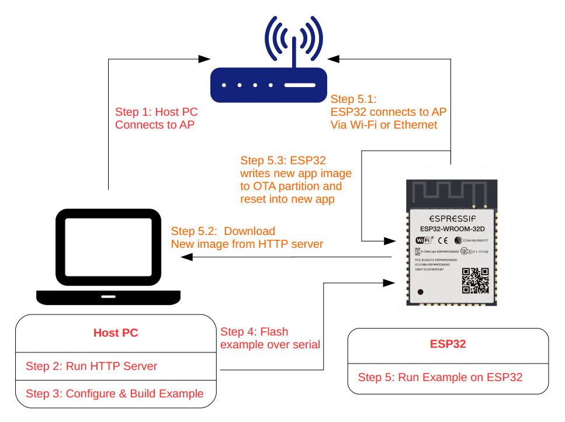

# OTA Example

---
**NOTES**

- This guide applies to all OTA update examples
- "ESP-Dev-Board" refers to any Espressif chipset development board (e.g., ESP32/ESP32-S2/ESP32-C3 etc.)
---


## Overview

An application on "ESP-Dev-Board" may be upgraded at runtime by downloading a new image via Wi-Fi or Ethernet and flashing it to an OTA partition. The ESP-IDF offers two methods to perform Over The Air (OTA) upgrades:

- Using the native APIs provided by the [`app_update`](../../../components/app_update) component.
- Using simplified APIs provided by the [`esp_https_ota`](../../../components/esp_https_ota) component, which provides functionality to upgrade over HTTPS.

Use of the native API is demonstrated in the `native_ota_example` directory while the API provided by the `esp_https_ota` component is demonstrated under `simple_ota_example` and `advanced_https_ota`.

For information regarding the `esp_https_ota` component, please refer to [ESP HTTPS OTA](https://docs.espressif.com/projects/esp-idf/en/latest/esp32/api-reference/system/esp_https_ota.html).

For simplicity, the OTA examples use a pre-defined partition table created by enabling the `CONFIG_PARTITION_TABLE_TWO_OTA` option in menuconfig, which supports three app partitions: `factory`, `OTA_0` and `OTA_1`. Please refer to [Partition Tables](https://docs.espressif.com/projects/esp-idf/en/latest/api-guides/partition-tables.html) for more information.

On first boot, the bootloader will load the image contained on the `factory` partition (i.e. the example image). This firmware triggers an OTA upgrade. It will download a new image from an HTTPS server and save it into the `OTA_0` partition. Next, it updates the `ota_data` partition to indicate which app should boot after the next reset. Upon reset, the bootloader  reads the contents of the `ota_data` partition to determine which application is selected to run.

The OTA workflow is illustrated in the following diagram:



## How to use the examples

### Hardware Required

"ESP-Dev-Board" is necessary to run the OTA examples. Make sure Ethernet is configured correctly if testing OTA with Ethernet. For further information about setting up Ethernet, please refer to the Ethernet [examples](../../ethernet).

### Configure the project

Open the project configuration menu (`idf.py menuconfig`).

In the `Example Connection Configuration` menu:

* Choose the network interface in the `Connect using`  option based on your board. Currently  both Wi-Fi and Ethernet are supported
* If the Wi-Fi interface is used, provide the Wi-Fi SSID and password of the AP you wish to connect to
* If using the Ethernet interface, set the PHY model under `Ethernet PHY Device` option, e.g. `IP101`

In the `Example Configuration` menu:

* Set the URL of the firmware to download in the `Firmware Upgrade URL` option. The format should be `https://<host-ip-address>:<host-port>/<firmware-image-filename>`, e.g. `https://192.168.2.106:8070/hello_world.bin`
  * **Note:** The server part of this URL (e.g. `192.168.2.106`) must match the **CN** field used when [generating the certificate and key](#run-https-server)

### Build and Flash

Run `idf.py -p PORT flash monitor` to build and flash the project. This command  checks if the partition table contains the `ota_data` partition and restores it to an initial state. This allows the newly loaded app to run from the `factory` partition.

(To exit the serial monitor, type ``Ctrl-]``.)

See the [Getting Started Guide](https://docs.espressif.com/projects/esp-idf/en/latest/get-started/index.html) for all steps required to configure and use the ESP-IDF to build projects.

## Example Output

### Configure HTTPS Server

After a successful build, we need to create a self-signed certificate and run a simple HTTPS server as follows:


* Enter the directory containing build artifact/s of project, that will be hosted by HTTPS server, e.g. `cd build`.
* To create a new self-signed certificate and key, run the command `openssl req -x509 -newkey rsa:2048 -keyout ca_key.pem -out ca_cert.pem -days 365 -nodes`.
  * When prompted for the `Common Name (CN)`, enter the name of the server that the "ESP-Dev-Board" will connect to. When running this example from a development machine, this is probably the IP address. The HTTPS client will check that the `CN` matches the address given in the HTTPS URL.
* This directory should contain the firmware (e.g. `hello_world.bin`) to be used in the update process. This can be any valid ESP-IDF application, as long as its filename corresponds to the name configured using `Firmware Upgrade URL` in menuconfig. The only difference to flashing a firmware via the serial interface is that the binary is flashed to the `factory` partition, while OTA update use one of the OTA partitions.

### Start HTTPS Server

#### OpenSSL based server

* To start openssl based HTTPS server, run the command `openssl s_server -WWW -key ca_key.pem -cert ca_cert.pem -port 8070`.

Sample console output as:
```bash
$ openssl s_server -WWW -key ca_key.pem -cert ca_cert.pem -port 8070
FILE:hello_world.bin
ACCEPT
```

* **Note:** The OpenSSL server cannot handle partial HTTP requests, so it does not support partial downloading. Alternatively you can start python based server using [Python based server](#Python-based-server)
* **Note:** Make sure incoming access to port *8070* is not prevented by firewall rules.
* **Note:** Windows users may encounter issues while running `openssl s_server -WWW`, due to CR/LF translation and/or closing the connection prematurely
  (Some windows builds of openssl translate CR/LF sequences to LF in the served files, leading to corrupted images received by the OTA client; others interpret the `0x1a`/`SUB` character in a binary as an escape sequence, i.e. end of file, and close the connection prematurely thus preventing the OTA client from receiving a complete image).
  * We recommend  using the `openssl` binary bundled in `Git For Windows` from the [ESP-IDF Tool installer](https://docs.espressif.com/projects/esp-idf/en/latest/get-started/windows-setup.html):
  Open the ESP-IDF command prompt and add the internal openssl binary to your path: `set PATH=%LocalAppData%\Git\usr\bin;%PATH%` and run openssl's http server command as above.

#### Python based server

* To start python based HTTPS server using [example_test_scipt](simple_ota_example/pytest_simple_ota.py), run `pytest_simple_ota.py <BIN_DIR> <PORT> [CERT_DIR]`, where:
    - `<BIN_DIR>` is a directory containing the firmware (e.g. `hello_world.bin`) to be used in the update process.`
    - `<PORT>` is the server's port, here `8070`
    - `[CERT_DIR]` is an optional argument pointing to a specific directory with the certificate and key file:`ca_cert.pem` and `ca_key.pem'.

Sample console output as:
``` bash
$ cd idf/examples/system/ota/simple_ota_example
$ python pytest_simple_ota.py build 8070
Starting HTTPS server at "https://:8070"
192.168.10.106 - - [02/Mar/2021 14:32:26] "GET /simple_ota.bin HTTP/1.1" 200 -
```

### Flash Certificate to "ESP-Dev-Board"

Finally, copy the generated certificate to the `server_certs` directory contained in the example directory so it can be flashed onto your device along with the firmware, e.g. `cp ca_cert.pem ../server_certs/`.

```
cp ca_cert.pem /path/to/ota/example/server_certs/
```

### Internal workflow of the OTA Example

After booting, the firmware:

1. prints "OTA example app_main start" to the console
2. Connects via Ethernet or to the AP using the provided SSID and password (Wi-Fi case)
3. prints "Starting OTA example task" to the console
4. Connects to the HTTPS server and downloads the new image
5. Writes the image to flash, and instructs the bootloader to boot from this image after the next reset
6. Reboots

If you want to rollback to the `factory` app after the upgrade (or to the first OTA partition in case the `factory` partition does not exist), run the command `idf.py erase_otadata`. This restores the `ota_data` partition to its initial state.

**Note:** This assumes that the partition table of this project is the one present on the device.

## Supporting Rollback

This feature allows you to roll back to a previous firmware if new image is not useable. The menuconfig option `CONFIG_BOOTLOADER_APP_ROLLBACK_ENABLE` allows you to track the first boot of the application (see the ``Over The Air Updates (OTA)`` article).

The ``native_ota_example`` contains code to demonstrate how a rollback works. To use it, enable the `CONFIG_BOOTLOADER_APP_ROLLBACK_ENABLE` option in the `Example Configuration` submenu of menuconfig to set `Number of the GPIO input for diagnostic` to manipulate the rollback process.

To trigger a rollback, this GPIO must be pulled low while the message `Diagnostics (5 sec)...` is displayed during the first boot.

If GPIO is not pulled low, the app is confirmed as operable.

## Support for Versioning of Applications

The ``native_ota_example`` contains code to demonstrate how to check the version of the application and prevent infinite firmware update loops. Only newer applications are downloaded. Version checking is performed after the first firmware image package containing version data is received. The application version is obtained from one of three places:

1. If the `CONFIG_APP_PROJECT_VER_FROM_CONFIG` option is set, the value of `CONFIG_APP_PROJECT_VER` is used
2. Else, if the ``PROJECT_VER`` variable is set in the project `CMakeLists.txt` file, this value is used
3. Else, if the file ``$PROJECT_PATH/version.txt`` exists, its contents are used as ``PROJECT_VER``
4. Else, if the project is located in a Git repository, the output of ``git describe`` is used
5. Otherwise, ``PROJECT_VER`` will be "1"

In ``native_ota_example``, ``$PROJECT_PATH/version.txt`` is used to define the app version. Change the version in the file to compile the new firmware.

## Troubleshooting

* Check that your PC can ping the "ESP-Dev-Board" using its IP, and that the IP, AP and other configuration settings are correctly configured in menuconfig
* Check if any firewall software is preventing incoming connections on the PC
* Check whether you can see the configured file (default `hello_world.bin`), by running the command `curl -v https://<host-ip-address>:<host-port>/<firmware-image-filename>`
* Try viewing the file listing from a separate host or phone

### Error "ota_begin error err=0x104"

If you see this error, check that the configured (and actual) flash size is large enough for the partitions in the partition table. The default "two OTA slots" partition table requires at least 4MB flash size. To use OTA with smaller flash sizes, create a custom partition table CSV (for details see [Partition Tables](https://docs.espressif.com/projects/esp-idf/en/latest/esp32/api-guides/partition-tables.html)) and configure it in menuconfig.

Make sure to run "idf.py erase-flash" after making changes to the partition table.

### Local HTTPS Server

Running a local https server might be tricky in some cases (due to self signed certificates, or potential issues with `openssl s_server` on Windows). Here are some suggestions for alternatives:
* Run a plain HTTP server to test the connection. (Note that using a plain http is **not secure** and should only be used for testing)
    - Execute `python -m http.server 8070` in the directory with the firmware image
    - Use http://<host-ip>:8070/<firmware-name> as the firmware upgrade URL
    - Enable *Allow HTTP for OTA* (`CONFIG_ESP_HTTPS_OTA_ALLOW_HTTP`) in `Component config -> ESP HTTPS OTA` so the URI without TLS is accepted

* Publish the firmware image on a public server (e.g. github.com) and copy its root certificate to the `server_certs` directory as `ca_cert.pem`. The certificate can be downloaded using the `s_client` openssl command as shown below:

```
echo "" | openssl s_client -showcerts -connect raw.githubusercontent.com:443 | sed -n "1,/Root/d; /BEGIN/,/END/p" | openssl x509 -outform PEM >ca_cert.pem
```

Please note that URL used here is `raw.githubusercontent.com`. This URL allows raw access to files hosted on github.com repository. Additionally, command above copies last certificate from chain of certs as the CA root cert of server.

### Using HTTPS Server in Production

Please refer to [ESP-TLS: TLS Server Verification](https://docs.espressif.com/projects/esp-idf/en/latest/esp32/api-reference/protocols/esp_tls.html#tls-server-verification) for more information on server verification. The root certificate (in PEM format) needs to be provided to the `cert_pem` member of the `esp_http_client_config_t` configuration.

Note that the server-endpoint **root** certificate should be used for verification instead of any intermediate ones from the certificate chain. The reason being that the root certificate has the maximum validity and usually remains the same for a long period of time.

Users can also use the `ESP x509 Certificate Bundle` feature for verification, which covers most of the trusted root certificates (using the `crt_bundle_attach` member of the `esp_http_client_config_t` configuration). There is no need to add any additional certificates. Please refer to the [simple_ota_example](simple_ota_example) for its usage.
