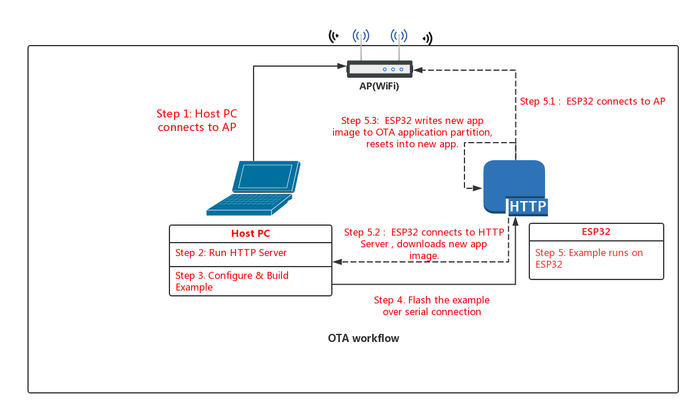

# OTA Demo

## Introduction

Over The Air (OTA) updates can be performed in esp32 in two ways:

- Using native APIs which are part of OTA component.
- Using simplified APIs which are part of `esp_https_ota`, it's an abstraction layer over OTA APIs to perform updates using HTTPS.

Both these methods are demonstrated in OTA Demo under `native_ota_example` and `simple_ota_example` respectively.

*Note: This guide is common for both the examples*

---

## Aim

An app running on ESP32 can upgrade itself by downloading a new app "image" binary file, and storing it in flash.

In this example, the ESP32 has 3 images in flash: factory, OTA_0, OTA_1. Each of these is a self-contained partition. The number of OTA image partition is determined by the partition table layout.

Flashing the example over serial with "make flash" updates the factory app image. On first boot, the bootloader loads this factory app image which then performs an OTA update (triggered in the example code). The update downloads a new image from a HTTPS server and saves it into the OTA_0 partition. At this point the example code updates the ota_data partition to indicate the new app partition, and resets. The bootloader reads ota_data, determines the new OTA image has been selected, and runs it.


## Workflow

The OTA_workflow.png diagram demonstrates the overall workflow:



### Step 1: Connect to AP

Connect your host PC to the same AP that you will use for the ESP32.

### Step 2: Run HTTPS Server

For our upgrade example OTA file, we're going to use the `get-started/hello_world` example.

Open a new terminal to run the HTTP server, then run these commands to build the example and start the server:

Build the example:

```
cd $IDF_PATH/examples/get-started/hello_world
make
cd build
```

Generate self-signed certificate and key:

*NOTE: `Common Name` of server certificate should be host-name of your server.*

```
openssl req -x509 -newkey rsa:2048 -keyout ca_key.pem -out ca_cert.pem -days 365

```

Copy the certificate to `server_certs` directory inside OTA example directory:

```
cp ca_cert.pem /path/to/ota/example/server_certs/
```


Start the HTTPS server:

```
openssl s_server -WWW -key ca_key.pem -cert ca_cert.pem -port 8070
```

NB: You've probably noticed there is nothing special about the "hello world" example when used for OTA updates. This is because any .bin app file which is built by esp-idf can be used as an app image for OTA. The only difference is whether it is written to a factory partition or an OTA partition.

If you have any firewall software running that will block incoming access to port 8070, configure it to allow access while running the example.

### Step 3: Build OTA Example

Change back to the OTA example directory, and type `make menuconfig` to configure the OTA example. Under the "Example Configuration" submenu, fill in the following details:

* WiFi SSID & Password
* Firmware Upgrade URL. The URL will be look like this:

```
https://<host-ip-address>:<host-port>/<firmware-image-filename>

for e.g,
https://192.168.0.3:8070/hello-world.bin
```

Save your changes, and type `make` to build the example.

### Step 4: Flash OTA Example

When flashing, use the `make flash` to flash the factory image. This command will find if partition table has ota_data partition (as in our case) then ota_data will erase to initial. 
It allows to run the newly loaded app from a factory partition.

```
make flash
```

After first update, if you want to return back to factory app (or the first OTA partition, if factory partition is not present) then use the command `make erase_ota`. 
It erases ota_data partition to initial.

### Step 5: Run the OTA Example

When the example starts up, it will print "Starting OTA example..." then:

1. Connect to the AP with configured SSID and password.
2. Connect to the HTTP server and download the new image.
3. Write the image to flash, and configure the next boot from this image.
4. Reboot

## Troubleshooting

* Check your PC can ping the ESP32 at its IP, and that the IP, AP and other configuration settings are correct in menuconfig.
* Check if any firewall software is preventing incoming connections on the PC.
* Check whether you can see the configured file (default hello-world.bin), by checking the output of following command:

 ```
 curl -v https://<host-ip-address>:<host-port>/<firmware-image-filename>
 ```

* If you have another PC or a phone, try viewing the file listing from the separate host.

### Error "ota_begin error err=0x104"

If you see this error then check that the configured (and actual) flash size is large enough for the partitions in the partition table. The default "two OTA slots" partition table only works with 4MB flash size. To use OTA with smaller flash sizes, create a custom partition table CSV (look in components/partition_table) and configure it in menuconfig.

If changing partition layout, it is usually wise to run "make erase_flash" between steps.
