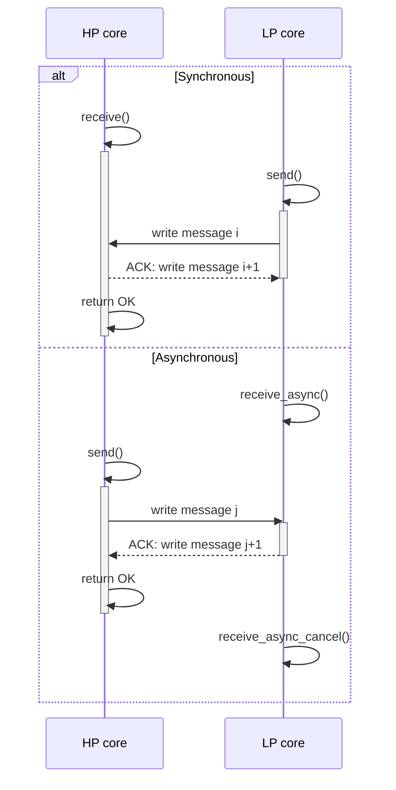

| Supported Targets | ESP32-C5 | ESP32-C6 | ESP32-P4 |
| ----------------- | -------- | -------- | -------- |

# LP Mailbox Example

(See the README.md file in the upper level 'examples' directory for more information about examples.)

## Overview

This example demonstrates how to use the mailbox for communication between the LP core and the HP core.
Unlike a classic ring buffer, the mailbox allows transmitting data between the two cores with or without acknowledgment and without requiring a particular order.
This makes it useful for sending sensor data or other streaming values that the LP core may measure.

## How to use example

### Hardware Required

To run this example, you should have an ESP based development board that integrates an LP core.

### Build and Flash

Enter `idf.py -p PORT flash monitor` to build, flash and monitor the project.

(To exit the serial monitor, type ``Ctrl-]``.)

See the [Getting Started Guide](https://docs.espressif.com/projects/esp-idf/en/latest/get-started/index.html) for full steps to configure and use ESP-IDF to build projects.


## Example Output

Upon execution, the example should print the following:

```
LP Mailbox initialized successfully
Final sum: 2957
```

## Timing diagram

The following diagram shows what a typical synchronous and asynchronous transaction looks like between the HP core and the LP core.

In the synchronous case, the sender waits for an acknowledgment before proceeding, ensuring that the message is fully processed.

In the asynchronous case, the receiver handles messages through asynchronous callbacks, which can also be canceled if needed at any time.



## Troubleshooting

(For any technical queries, please open an [issue](https://github.com/espressif/esp-idf/issues) on GitHub. We will get back to you as soon as possible.)
