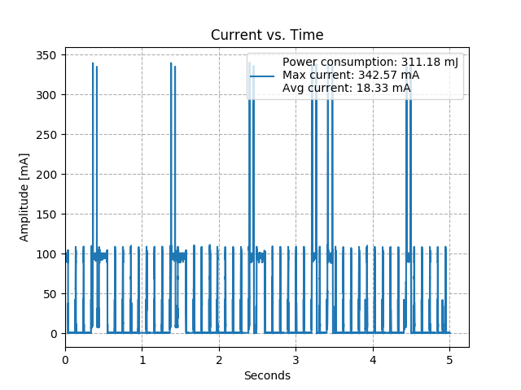
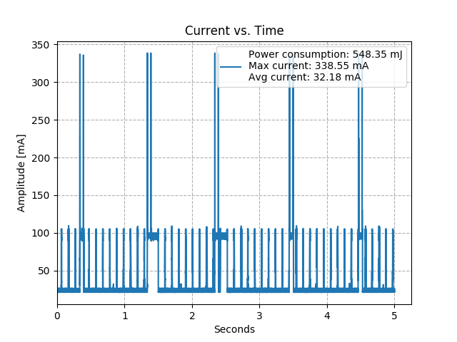

| Supported Targets | ESP32 | ESP32-C2 | ESP32-C3 | ESP32-C6 | ESP32-S2 | ESP32-S3 |
| ----------------- | ----- | -------- | -------- | -------- | -------- | -------- |

# Wifi Power Save Example

This example shows how to use power save mode of wifi.

Power save mode only works in station mode. If the modem sleep mode is enabled, station will switch between active and sleep state periodically after connecting to AP successfully. In sleep state, RF, PHY and BB are turned off in order to reduce power consumption. Station can keep connection with AP in modem sleep mode.

* No power save: This is default mode. And the esp32 will work with full power.

* Minimum modem sleep: In minimum modem sleep mode, station wakes up every DTIM to receive beacon. Broadcast data will not be lost because it is transmitted after DTIM. However, it can not save much more power if DTIM is short for DTIM is determined by AP.

* Maximum modem sleep: In maximum modem sleep mode, station wakes up every listen interval to receive beacon. Broadcast data may be lost because station may be in sleep state at DTIM time. If listen interval is longer, more power is saved but broadcast data is more easy to lose.

* others: not supported yet.

### Typical current consumption with management enabled

### Typical current consumption with management disabled

Note that current consumption and average current are higher when disabled.
