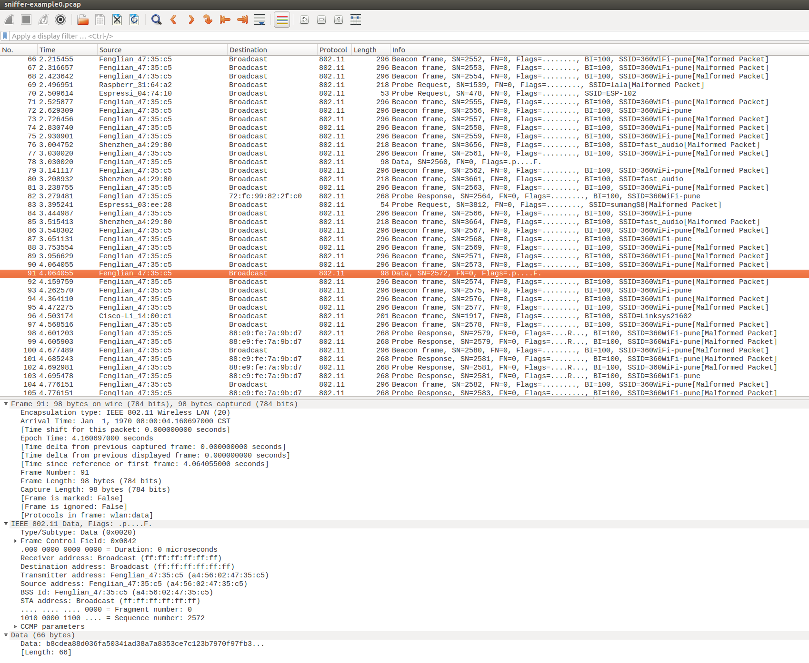

# Simple Sniffer Example

(See the README.md file in the upper level 'examples' directory for more information about examples.)

## Overview

This example demonstrates basic usage of wifi sniffer mode by saving packets into SD card with pcap format. Go to wikipedia for more information about [pcap](https://en.wikipedia.org/wiki/Pcap).

This example is based on esp-idf's console component. For more information about console you should read this [guide](https://docs.espressif.com/projects/esp-idf/en/latest/api-guides/console.html).

## How to use example

### Hardware Required

To run this example, you should have one ESP32 dev board integrated with a SD card slot (e.g ESP32-WROVER Kit) or just connect ESP32-DevKitC to a SD card breakout board.

### Configure the project

Enter `make menuconfig` if you are using GNU Make based build system or enter `idf.py menuconfig` if you are using CMake based build system. Then go into `Example Configuration` menu.

- Check `Store command history in flash` if you want to save command history into flash (recommend).
- Set the mount point in your filesystem, for example, `/sdcard` if you want to store pcap file into SD card.
- Set the length of sniffer work queue.
- Set the stack size of the sniffer task.
- Set the priority of the sniffer task.
- Set the max number of packets to store in a single pcap file. The number of packets usually will be very large, so we just truncate them into multiple files. You should set a threshold value here.

### Build and Flash

Enter `make -j4 flash monitor` if you are using GNU Make based build system or enter `idf.py build flash monitor` if you' are using CMake based build system.

(To exit the serial monitor, type ``Ctrl-]``.)

See the [Getting Started Guide](https://docs.espressif.com/projects/esp-idf/en/latest/get-started/index.html) for full steps to configure and use ESP-IDF to build projects.

## Example Output

### `sniffer` Command Usage

> sniffer  [-f <file>][-i ] [-F <mgmt|data|ctrl|misc|mpdu|ampdu>]... [-c <channel>][--stop]
>   Capture specific packet and store in pcap format
>   -f, --file=<file>  name of the file storing the packets in pcap format
>   -i, --interface=<wlan>  which interface to capture packet
>   -F, --filter=<mgmt|data|ctrl|misc|mpdu|ampdu>  filter parameters
>   -c, --channel=<channel>  communication channel to use
>         --stop  stop running sniffer

The `sniffer` command support some important options as follow:

* `-f`: Specify the name of file who will store the packets, default value is `sniffer`, and the resulting file name will be like “snifferX.pcap”, here ‘X’ shows the file’s order.
* `-i`: Specify the interface to sniffer packets, currently only support `wlan`
* `-c` :Specify the channel to sniffer packet
* `-F`: Specify the filter condition, currently only support following filter conditions, you can select any number of them
  * mgmt: Management packets
  * data: Data packets
  * ctrl: Control packets
  * misc: Other packets
  * mpdu: MPDU packets
  * ampdu: AMPDU packets
* `--stop`: Stop sniffer job

### Mount SD Card

```bash
 =======================================================
 |       Steps to sniffer WiFi packets                 |
 |                                                     |
 |  1. Enter 'help' to check all commands' usage       |
 |  2. Enter 'mount <device>' to mount filesystem      |
 |  3. Enter 'sniffer' to start capture packets        |
 |  4. Enter 'unmount <device>' to unmount filesystem  |
 |                                                     |
 =======================================================

esp32> mount sd
I (158912) example: Initializing SD card
I (158912) example: Using SDMMC peripheral
I (158912) gpio: GPIO[13]| InputEn: 0| OutputEn: 1| OpenDrain: 0| Pullup: 0| Pulldown: 0| Intr:0 
Name: SA16G
Type: SDHC/SDXC
Speed: 20 MHz
Size: 14832MB
```

### Start Sniffer

```bash
esp32> sniffer -f sniffer-example -i wlan -c 2
I (36200) cmd_sniffer: Start WiFi Promicuous Mode
I (36270) phy: phy_version: 4000, b6198fa, Sep  3 2018, 15:11:06, 0, 0
I (36270) wifi: ic_enable_sniffer
I (36290) pcap: Store packets to file: /sdcard/sniffer-example0.pcap
I (103810) pcap: Close Pcap file OK
I (103830) pcap: Store packets to file: /sdcard/sniffer-example1.pcap
I (177300) pcap: Close Pcap file OK
I (177320) pcap: Store packets to file: /sdcard/sniffer-example2.pcap
esp32> sniffer --stop
I (212250) wifi: ic_disable_sniffer
I (212250) wifi: flush txq
I (212250) wifi: stop sw txq
I (212260) wifi: lmac stop hw txq
I (212340) pcap: Close Pcap file OK
I (212340) cmd_sniffer: Sniffer Stopped
```

### Unmount SD Card

```bash
esp32> unmount sd
I (248800) example: Card unmounted
```

### Open PCap File in Wireshark



## Troubleshooting

- Make sure you have pluged in your SD card and mount it into filesystem before doing sniffer work or you will get error message like “Create file /sdcard/sniffer0.pcap failed”.
- To protect the SD card, we recommand you to execute command `unmount sd` before you plug out your SD card.


(For any technical queries, please open an [issue](https://github.com/espressif/esp-idf/issues) on GitHub. We will get back to you as soon as possible.)