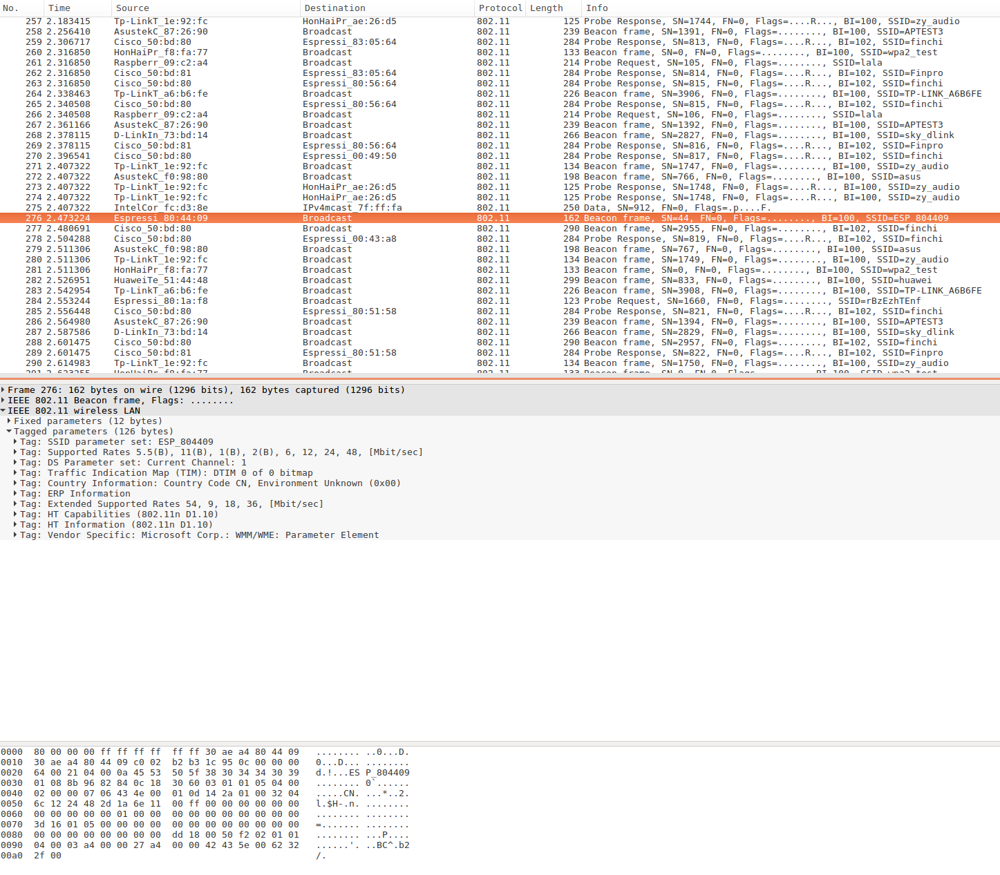

# Simple Sniffer Example

(See the README.md file in the upper level 'examples' directory for more information about examples.)

## Overview

This example demonstrates basic usage of WiFi sniffer mode by saving packets into SD card with pcap format. We can send pcap file to host via JTAG interface as well.

For more information about pcap, please go to [wikipedia](https://en.wikipedia.org/wiki/Pcap).

This example is based on console component. For more information about console, please refer to [console guide](https://docs.espressif.com/projects/esp-idf/en/latest/api-guides/console.html).

## How to use example

### Hardware Required

To run this example, you should have one ESP32 dev board integrated with a SD card slot (e.g [ESP-WROVER-KIT](https://docs.espressif.com/projects/esp-idf/en/latest/hw-reference/modules-and-boards.html#esp-wrover-kit-v4-1)) or just connect [ESP32-DevKitC](https://docs.espressif.com/projects/esp-idf/en/latest/hw-reference/modules-and-boards.html#esp32-devkitc-v4) to a SD card breakout board. 
If you want to send packets to host, make sure to connect ESP32 to some kind of [JTAG adapter](https://docs.espressif.com/projects/esp-idf/en/latest/api-guides/jtag-debugging/index.html#jtag-debugging-selecting-jtag-adapter).

### Configure the project

Open the project configuration menu (`idf.py menuconfig`). Then go into `Example Configuration` menu.

- Check `Store command history in flash` if you want to save command history into flash (recommend).
- Select where to save the pcap file in `Select destination to store pcap file` menu item.
  - `SD Card` means saving packets (pcap format) into the SD card you plug in.
  - `JTAG (App Trace)` means sending packets (pcap format) to host via JTAG interface. This feature depends on [app trace component](https://docs.espressif.com/projects/esp-idf/en/latest/api-guides/app_trace.html).
- Set the mount point in your filesystem in `SD card mount point in the filesystem` menu item. This configuration only takes effect when you choose to save packets into SD card.
- Set max name length of pcap file in `Max name length of pcap file` menu item.
- Set the length of sniffer work queue in `Length of sniffer work queue` menu item.
- Set the stack size of the sniffer task in `Stack size of sniffer task` menu item.
- Set the priority of the sniffer task `Length of sniffer work queue` menu item.

### Build and Flash

```
idf.py -p PORT flash monitor
```

(Replace PORT with name of the serial port.)

(To exit the serial monitor, type ``Ctrl-]``.)

See the [Getting Started Guide](https://docs.espressif.com/projects/esp-idf/en/latest/get-started/index.html) for full steps to configure and use ESP-IDF to build projects.

## Example Output

### `sniffer` Command Usage

> sniffer  [-f <file>][-i ] [-F <mgmt|data|ctrl|misc|mpdu|ampdu>]... [-c <channel>][--stop]
>   Capture specific packet and store in pcap format
>   -f, --file=<file>  name of the file storing the packets in pcap format
>   -i, --interface=<wlan>  which interface to capture packet
>   -F, --filter=<mgmt|data|ctrl|misc|mpdu|ampdu>  filter parameters
>   -c, --channel=<channel>  communication channel to use
>         --stop  stop running sniffer

The `sniffer` command support some important options as follow:

* `-f`: Specify the name of file who will store the packets, default value is `sniffer`, and the resulting file name will be like “snifferX.pcap”, here ‘X’ shows the file’s order.
* `-i`: Specify the interface to sniffer packets, currently only support `wlan`
* `-c` :Specify the channel to sniffer packet
* `-F`: Specify the filter condition, currently only support following filter conditions, you can select any number of them
  * mgmt: Management packets
  * data: Data packets
  * ctrl: Control packets
  * misc: Other packets
  * mpdu: MPDU packets
  * ampdu: AMPDU packets
* `--stop`: Stop sniffer job

### Mount SD Card

```bash
 =======================================================
 |       Steps to sniffer WiFi packets                 |
 |                                                     |
 |  1. Enter 'help' to check all commands' usage       |
 |  2. Enter 'mount <device>' to mount filesystem      |
 |  3. Enter 'sniffer' to start capture packets        |
 |  4. Enter 'unmount <device>' to unmount filesystem  |
 |                                                     |
 =======================================================

esp32> mount sd
I (158912) example: Initializing SD card
I (158912) example: Using SDMMC peripheral
I (158912) gpio: GPIO[13]| InputEn: 0| OutputEn: 1| OpenDrain: 0| Pullup: 0| Pulldown: 0| Intr:0 
Name: SA16G
Type: SDHC/SDXC
Speed: 20 MHz
Size: 14832MB
```

### Start Sniffer

```bash
esp32> sniffer -f sniffer-example -i wlan -c 2
I (8946) cmd_sniffer: open file successfully
W (8966) phy_init: failed to load RF calibration data (0x1102), falling back to full calibration
I (9176) phy: phy_version: 4100, 6fa5e27, Jan 25 2019, 17:02:06, 0, 2
I (9186) wifi: ic_enable_sniffer
I (9196) cmd_sniffer: start WiFi promiscuous ok
esp32> sniffer --stop
I (31456) wifi: ic_disable_sniffer
I (31456) wifi: flush txq
I (31456) wifi: stop sw txq
I (31456) wifi: lmac stop hw txq
I (31456) cmd_sniffer: stop WiFi promiscuous ok
```

### Unmount SD Card

```bash
esp32> unmount sd
I (248800) example: Card unmounted
```

### Steps for sending packets to host via JTAG interface
1. Select `JTAG (App Trace)` as the destination of pcap files.
2. Build & Flash with `idf.py -p PORT flash`
3. Connect JTAG, run OpenOCD (for more information about how-to please refer to [JTAG Debugging](https://docs.espressif.com/projects/esp-idf/en/latest/api-guides/jtag-debugging/index.html)).
4. Telnet to localhost with 4444 port: `telnet localhost 4444`.
5. In the telnet session, run command like `esp32 apptrace start file://sniffer-esp32.pcap 1 -1 20` (more information about this command, please refer to [apptrace command](https://docs.espressif.com/projects/esp-idf/en/latest/api-guides/app_trace.html#openocd-application-level-tracing-commands)).
6. Run the example, start sniffer with command `sniffer` (you don't need to specify the filename, because it has been set in step5).
7. Stop sniffer by entering command `sniffer --stop` in the example console.
8. Stop tracing by entering command `esp32 apptrace stop` in the telnet session.


### Open PCap File in Wireshark



## Troubleshooting

- Make sure you have pluged in your SD card and mount it into filesystem before doing sniffer work or you will get error message like “Create file /sdcard/sniffer0.pcap failed”.
- To protect the SD card, we recommand you to execute command `unmount sd` before you plug out your SD card.
- Make sure to run `esp32 apptrace` command before or immediately after a new sniffer task started when you try this example with JTAG. Otherwise the console will issue warning message `waiting for apptrace established` every 1 second. If the apptrace communication doesn't be established within 10 seconds (can be altered by macro `SNIFFER_APPTRACE_RETRY`), this sniffer command will failed with an error message `waiting for apptrace established timeout`.

(For any technical queries, please open an [issue](https://github.com/espressif/esp-idf/issues) on GitHub. We will get back to you as soon as possible.)
