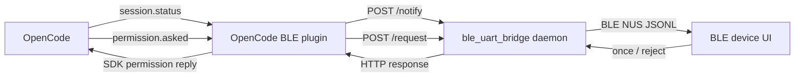

# BLE UART Bridge Demo - OpenCode Integration

This demo sketches how to bridge OpenCode events to a BLE device through
`tools/ble/ble_uart_bridge`.

It is intentionally small and example-oriented. Both this OpenCode plugin and
the `ble_uart_bridge` daemon protocol are demos that show one possible local IPC
pattern; developers are encouraged to customize the plugin payloads, firmware UI,
device decisions, and daemon-side protocol handling for their own products.

## Table of contents

- [Goal](#goal)
- [Quick Start](#quick-start)
- [How it relates to BLE UART Bridge](#how-it-relates-to-ble-uart-bridge)
  - [Daemon JSONL protocol summary](#daemon-jsonl-protocol-summary)
- [Files](#files)
- [Demo and customization notes](#demo-and-customization-notes)
- [Environment variables](#environment-variables)
- [Current assumptions](#current-assumptions)
- [Message routing](#message-routing)
- [Firmware protocol reference](#firmware-protocol-reference)
  - [Plugin message: session status](#plugin-message-session-status)
  - [Plugin message: permission cancel](#plugin-message-permission-cancel)
  - [Plugin message: permission request](#plugin-message-permission-request)
  - [Firmware UI sketch](#firmware-ui-sketch)
  - [Safety defaults](#safety-defaults)
- [Open items](#open-items)

## Goal

Use an OpenCode plugin to:

- forward session status events to a BLE device;
- forward permission requests to a BLE device;
- receive `once` / `reject` decisions from the device;
- reply to OpenCode permission requests through the OpenCode SDK client.



## Quick Start

1. Prepare a BLE device firmware example.

   The intended firmware companion is an `esp-vocat` example for the MiaoBan
   (喵伴) device, planned for the `esp-iot-solution` repository. Until that
   example is available, use any device that implements Nordic UART Service and
   the JSONL request/response envelope described in
   [Firmware protocol reference](#firmware-protocol-reference).

2. Install the bridge dependencies:

   ```bash
   python -m pip install -r tools/ble/ble_uart_bridge/requirements.txt
   ```

3. Start the BLE UART daemon:

   ```bash
   python tools/ble/ble_uart_bridge/main.py list-devices
   python tools/ble/ble_uart_bridge/main.py daemon "<device_id>" --host 127.0.0.1 --port 8888
   ```

   The plugin connects to `http://127.0.0.1:8888` by default. If the daemon uses
   another endpoint, inject it with `OPENCODE_BLE_DAEMON_URL` before starting
   OpenCode:

   ```bash
   export OPENCODE_BLE_DAEMON_URL="http://127.0.0.1:9999"
   ```

4. Copy or symlink the plugin into an OpenCode plugin directory, keeping the
   TypeScript files together in one subdirectory.

   Project-level install, for one project only:

   ```bash
   mkdir -p <proj-path>/.opencode/plugins/opencode-ble-uart-bridge
   cp tools/ble/ble_uart_bridge/demos/opencode/src/*.ts <proj-path>/.opencode/plugins/opencode-ble-uart-bridge/
   ```

   User-level install, for all projects that use this OpenCode user config:

   ```bash
   mkdir -p ~/.config/opencode/plugins/opencode-ble-uart-bridge
   cp tools/ble/ble_uart_bridge/demos/opencode/src/*.ts ~/.config/opencode/plugins/opencode-ble-uart-bridge/
   ```

5. Merge the relevant parts of `opencode.json.example` into your `opencode.json`.

   For OpenCode plugin loading details, see the official
   [OpenCode plugin documentation](https://opencode.ai/docs/en/plugins/).

   Project-level `opencode.json` example:

   ```json
   {
     "plugin": [
       ".opencode/plugins/opencode-ble-uart-bridge/opencode-ble-uart-bridge.ts"
     ],
     "permission": {
       "edit": "ask"
     }
   }
   ```

   User-level `~/.config/opencode/opencode.json` example:

   ```json
   {
     "plugin": [
       "<home-path>/.config/opencode/plugins/opencode-ble-uart-bridge/opencode-ble-uart-bridge.ts"
     ],
     "permission": {
       "edit": "ask"
     }
   }
   ```

   - `plugin` tells OpenCode which plugin module to load when the session starts.
     The official docs describe local plugin auto-loading from
     `<proj-path>/.opencode/plugins/` and `~/.config/opencode/plugins/`. This
     demo keeps the entry file and helper modules together in one subdirectory,
     so `opencode.json.example` points directly to the entry TypeScript file.
     For user-level installs, point this entry to the installed file under
     `~/.config/opencode/plugins/opencode-ble-uart-bridge/`; use an absolute
     home path if your OpenCode config loader does not expand `~`.
   - `permission.edit: "ask"` makes OpenCode ask before using the `edit` tool.
     Those permission prompts are what this plugin forwards to the BLE device as
     `permission.request` messages.

6. Start OpenCode after the daemon is running.

   OpenCode loads plugins during startup. This demo checks `GET /status` while
   loading and during relevant session events. If the daemon is unreachable, the
   plugin stays loaded but marks BLE forwarding as disabled and shows an OpenCode
   TUI notification instead of printing connection errors into the TUI log. When
   `/status` becomes reachable again, the plugin updates its state and can resume
   forwarding.

   To verify the path, trigger an `edit` permission request. The BLE device
   should receive a `permission.request` JSONL message and return `once` or
   `reject`.

After the `esp-vocat` example is published in `esp-iot-solution`, this section
should be updated with the exact example path, build/flash commands, and any
MiaoBan-specific button or display behavior.

## How it relates to BLE UART Bridge

The OpenCode plugin does not talk to BLE directly. It sends local HTTP requests
to the BLE UART Bridge daemon, and the daemon keeps the BLE connection open for
the plugin:

- `POST /notify` sends fire-and-forget events, such as session status updates.
- `POST /request` sends request/response messages, such as permission prompts
  that must wait for a device decision.
- `GET /status` can be used by tools to inspect daemon health and connection
  state.

For the daemon itself, see:

- [BLE UART Bridge README](../../README.md)
- [BLE UART Daemon Quick Start](../../docs/Quick-Start-BLE-UART-Daemon.md)

### Daemon JSONL protocol summary

The daemon forwards HTTP messages over BLE UART as newline-delimited JSON
(JSONL). Every BLE message is one JSON object followed by a final `\n`. The
example daemon protocol is named `esp-jsonl-rpc-lite-v1`.

Host-to-device messages use a small envelope:

```json
{"v":1,"id":"<bridge-request-id>","op":"permission.request","data":{"v":1,"kind":"permission.request"}}
```

Device-to-host responses echo the same `id` and return either `data` or an
`error`:

```json
{"v":1,"id":"<bridge-request-id>","ok":true,"data":{"decision":"once"}}
```

The daemon envelope is only a demonstration protocol, not a complete RPC
framework. It is designed to be easy to inspect, easy to parse with firmware
JSON libraries such as `cJSON`, and easy to replace with an application-specific
protocol when needed. The OpenCode-specific payloads carried in the `data` field
are documented below in [Firmware protocol reference](#firmware-protocol-reference).

## Files

- `src/opencode-ble-uart-bridge.ts` — OpenCode plugin entry point using `/notify` for status and `/request` for permission decisions.
- `src/*.ts` helper modules — typed, commented demo code for payloads, BLE daemon transport, OpenCode replies, and permission queue handling.
- `opencode.json.example` — example OpenCode config to load the plugin and ask for permissions.

## Demo and customization notes

This directory is meant to be copied, modified, and used as a starting point:

- Change `src/permission-payload.ts` if the BLE device needs a different display
  model for OpenCode permissions.
- Change the [Firmware protocol reference](#firmware-protocol-reference) and the
  firmware parser together if you add more message kinds, decision types,
  buttons, or display states.
- Set `OPENCODE_BLE_DAEMON_URL` if the daemon runs on a different local
  host/port.
- Keep local security requirements in mind. The daemon defaults to
  `127.0.0.1:8888` and exposes unauthenticated local HTTP endpoints; do not bind
  it to a public interface without adding your own access control.

The current demo intentionally keeps the BLE device decision model simple:
permission requests can be approved once with `once` or denied with `reject`.

## Environment variables

- `OPENCODE_BLE_DAEMON_URL`: BLE daemon base URL. Defaults to
  `http://127.0.0.1:8888`.
- `OPENCODE_BLE_DECISION_TIMEOUT_SECONDS`: permission decision timeout in
  seconds. Defaults to `60`; set it to a positive number.
- `OPENCODE_BLE_DEBUG=1`: enables verbose local plugin logs.

## Current assumptions

- The BLE daemon endpoint is configured by `OPENCODE_BLE_DAEMON_URL`, defaulting
  to `http://127.0.0.1:8888`.
- The BLE daemon supports both `POST /notify` and `POST /request`.
- The BLE device implements Nordic UART Service.
- The BLE device understands JSON messages described in
  [Firmware protocol reference](#firmware-protocol-reference).
- Permission decisions from the current single-key device are: `once`, `reject`.
- Permission requests are queued so the BLE device only displays one active
  prompt at a time.
- The plugin fills missing permission `type` / `title` / `metadata` fields before sending to the device.
- Permission metadata sent to BLE is compacted to one display field (`command`, `path`, `url`, or first string field) and truncated.
- Session status forwarding is best-effort and should not block OpenCode.
- The plugin checks daemon `/status` to maintain a connected, degraded, or
  disabled BLE forwarding state. State changes are reported with OpenCode TUI
  notifications when `client.tui.showToast` is available.
- If BLE forwarding is disabled or the BLE daemon cannot return a permission
  decision, the plugin replies `reject`.

## Message routing

- `session.status` uses `POST /notify` because it is telemetry and does not require a device response.
- `permission.request` uses `POST /request` because OpenCode must wait for the device's `once` / `reject` decision.
- `permission.cancel` uses `POST /notify` because it only tells the device to clear a pending permission UI.
- The plugin sends structured JSON objects as daemon `data`; it does not double-encode plugin payloads as JSON strings.

## Firmware protocol reference

The BLE UART Bridge daemon wraps plugin messages into JSONL over BLE UART. For
request/response RPC, `POST /request` sends a non-empty bridge request ID:

```json
{"v":1,"id":"<bridge-request-id>","op":"permission.request","data":{"v":1,"kind":"permission.request"}}
```

The BLE device must reply with the same bridge request ID. Successful responses
can return structured JSON in `data`:

```json
{"v":1,"id":"<bridge-request-id>","ok":true,"data":{"decision":"once"}}
```

For fire-and-forget telemetry, `POST /notify` sends an empty bridge request ID.
The BLE device should process the message and must not reply:

```json
{"v":1,"id":"","op":"session.status","data":{"v":1,"kind":"session.status"}}
```

Both directions are newline-delimited JSON. Plugin payloads are sent as
structured JSON objects in the daemon `data` field, not as JSON-encoded strings.

### Plugin message: session status

Sent through daemon `POST /notify` when OpenCode publishes `session.status`.
The daemon envelope uses `op: "session.status"` and `id: ""`.

```json
{
  "v": 1,
  "kind": "session.status",
  "event_id": "evt_...",
  "session_id": "ses_...",
  "requires_reply": false,
  "payload": {
    "type": "busy"
  }
}
```

Device response: none.

### Plugin message: permission cancel

Sent through daemon `POST /notify` when OpenCode reaches `session.status: idle`
while a BLE permission request is still pending on the device. This covers cases
where the same permission was answered from the OpenCode TUI instead of the BLE
device. The daemon envelope uses `op: "permission.cancel"` and `id: ""`.

```json
{
  "v": 1,
  "kind": "permission.cancel",
  "event_id": "evt_...",
  "session_id": "ses_...",
  "requires_reply": false,
  "payload": {
    "reason": "opencode_state_changed"
  }
}
```

Device response: none. The device should clear any pending permission UI and
must not emit a later reply for the cancelled request.

### Plugin message: permission request

Sent through daemon `POST /request` when OpenCode publishes `permission.asked`.
The daemon envelope uses `op: "permission.request"` and a non-empty request ID.

```json
{
  "v": 1,
  "kind": "permission.request",
  "event_id": "evt_...",
  "session_id": "ses_...",
  "permission_id": "perm_...",
  "requires_reply": true,
  "payload": {
    "id": "perm_...",
    "sessionID": "ses_...",
    "type": "bash",
    "title": "Run command",
    "metadata": {
      "command": "git status"
    }
  }
}
```

Device response in the daemon JSONL envelope:

```json
{
  "v": 1,
  "id": "<bridge-request-id>",
  "ok": true,
  "data": {
    "decision": "once",
    "message": "Approved from BLE device"
  }
}
```

Device error response in the daemon JSONL envelope:

```json
{
  "v": 1,
  "id": "<bridge-request-id>",
  "ok": false,
  "error": "device rejected permission"
}
```

The daemon turns this into an HTTP error for `/request`; the plugin fails closed
and replies `reject` to OpenCode.

Valid decisions:

- `once`
- `reject`

### Firmware UI sketch

For `session.status`:

- show `busy`, `idle`, or `retry`.

For `permission.request`:

- show permission type/title;
- show compact metadata such as command/path/url;
- expose two actions on the current single-key device: `Once` and `Reject`.

The OpenCode plugin normalizes optional permission fields before forwarding to
the device: missing `type` becomes `unknown`, missing `title` becomes
`Permission request`, and missing/non-string metadata becomes `{}`. Metadata is
compacted to one display field (`command`, `path`, `url`, or first string field)
and truncated before crossing BLE.

### Safety defaults

- If the device UI times out, return `reject`.
- If JSON parsing fails, return an error response.
- Keep displayed metadata short to avoid leaking large prompts or secrets.

## Open items

- Add an integration test with a mocked BLE daemon.
