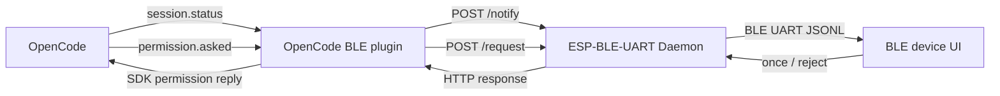

# ESP-BLE-UART Bridge Demo - OpenCode Integration

This demo sketches how to bridge OpenCode events to a BLE device through
`tools/ble/ble_uart_bridge`.

It is intentionally small and example-oriented. Both this OpenCode plugin and
the `ble_uart_bridge` daemon protocol are demos that show one possible local IPC
pattern; developers are encouraged to customize the plugin payloads, firmware UI,
device decisions, and daemon-side protocol handling for their own products.

## Table of contents

- [Goal](#goal)
- [Quick Start](#quick-start)
- [How it relates to ESP-BLE-UART Bridge](#how-it-relates-to-esp-ble-uart-bridge)
  - [Daemon JSONL protocol summary](#daemon-jsonl-protocol-summary)
- [Files](#files)
- [Demo and customization notes](#demo-and-customization-notes)
- [Environment variables](#environment-variables)
- [Current assumptions](#current-assumptions)
- [Message routing](#message-routing)
- [Indicator device support (vibe_indicator)](#indicator-device-support-vibe_indicator)
  - [Device-type detection](#device-type-detection)
  - [Lamp effects](#lamp-effects)
  - [Binding a channel (multiple instances, one device)](#binding-a-channel-multiple-instances-one-device)
- [Firmware protocol reference](#firmware-protocol-reference)
  - [Plugin message: session status](#plugin-message-session-status)
  - [Plugin message: permission cancel](#plugin-message-permission-cancel)
  - [Plugin message: permission request](#plugin-message-permission-request)
  - [Firmware UI sketch](#firmware-ui-sketch)
  - [Safety defaults](#safety-defaults)
- [Open items](#open-items)

## Goal

Use an OpenCode plugin to:

- forward session status events to a BLE device;
- forward permission requests to a BLE device;
- receive `once` / `reject` decisions from the device;
- reply to OpenCode permission requests through the OpenCode SDK client.



## Quick Start

1. Prepare a BLE device firmware example.

   The intended firmware companion is the `esp-vocat` example for the MiaoBan
   (喵伴) device, available in the
   [esp-iot-solution](https://github.com/espressif/esp-iot-solution) repository
   at `examples/bluetooth/ble_uart_service`. See the example README for
   supported boards, dependency versions, and build instructions. Alternatively,
   use any device that implements the default BLE UART-over-GATT UUIDs and the
   JSONL request/response envelope described in
   [Firmware protocol reference](#firmware-protocol-reference).

2. Install the bridge dependencies:

   ```bash
   python -m pip install -r tools/ble/ble_uart_bridge/requirements.txt
   ```

3. Start the ESP-BLE-UART Daemon:

   ```bash
   python tools/ble/ble_uart_bridge/main.py list-devices
   python tools/ble/ble_uart_bridge/main.py daemon "<device_id>" --host 127.0.0.1 --port 8888
   ```

   The plugin connects to `http://127.0.0.1:8888` by default. If the daemon uses
   another endpoint, inject it with `OPENCODE_BLE_DAEMON_URL` before starting
   OpenCode:

   ```bash
   export OPENCODE_BLE_DAEMON_URL="http://127.0.0.1:9999"
   ```

4. Copy or symlink the plugin into an OpenCode plugin directory, keeping the
   TypeScript files together in one subdirectory.

   Project-level install, for one project only:

   ```bash
   mkdir -p <proj-path>/.opencode/plugins/opencode-ble-uart-bridge
   cp tools/ble/ble_uart_bridge/demos/opencode/src/*.ts <proj-path>/.opencode/plugins/opencode-ble-uart-bridge/
   ```

   User-level install, for all projects that use this OpenCode user config:

   ```bash
   mkdir -p ~/.config/opencode/plugins/opencode-ble-uart-bridge
   cp tools/ble/ble_uart_bridge/demos/opencode/src/*.ts ~/.config/opencode/plugins/opencode-ble-uart-bridge/
   ```

   > **Note:** OpenCode's auto-loader may only scan the top-level of the plugin
   > directory (not subdirectories). If the plugin does not load after copying
   > the files, add an explicit entry in `opencode.json` (see step 5) pointing
   > to the entry TypeScript file with an **absolute path** — this is the
   > reliable method that works across all OpenCode versions.

5. Merge the relevant parts of `opencode.json.example` into your `opencode.json`.

   For OpenCode plugin loading details, see the official
   [OpenCode plugin documentation](https://opencode.ai/docs/en/plugins/).

   Project-level `opencode.json` example:

   ```json
   {
     "plugin": [
       ".opencode/plugins/opencode-ble-uart-bridge/opencode-ble-uart-bridge.ts"
     ],
     "permission": {
       "edit": "ask"
     }
   }
   ```

   User-level `~/.config/opencode/opencode.json` example:

   ```json
   {
     "plugin": [
       "<home-path>/.config/opencode/plugins/opencode-ble-uart-bridge/opencode-ble-uart-bridge.ts"
     ],
     "permission": {
       "edit": "ask"
     }
   }
   ```

   - `plugin` tells OpenCode which plugin module to load when the session starts.
     The official docs describe local plugin auto-loading from
     `<proj-path>/.opencode/plugins/` and `~/.config/opencode/plugins/`. This
     demo keeps the entry file and helper modules together in one subdirectory,
     so `opencode.json.example` points directly to the entry TypeScript file.
     For user-level installs, point this entry to the installed file under
     `~/.config/opencode/plugins/opencode-ble-uart-bridge/`; use an absolute
     home path if your OpenCode config loader does not expand `~`.
   - `permission.edit: "ask"` makes OpenCode ask before using the `edit` tool.
     Those permission prompts are what this plugin forwards to the BLE device as
     `permission.request` messages.

6. Start OpenCode after the daemon is running.

   OpenCode loads plugins during startup. This demo checks `GET /status` while
   loading and during relevant session events. If the daemon is unreachable, the
   plugin stays loaded but marks BLE forwarding as disabled and shows an OpenCode
   TUI notification instead of printing connection errors into the TUI log. When
   `/status` becomes reachable again, the plugin updates its state and can resume
   forwarding.

   To verify the path, trigger an `edit` permission request. The BLE device
   should receive a `permission.request` JSONL message and return `once` or
   `reject`.

The `esp-vocat` example is available in the
[esp-iot-solution](https://github.com/espressif/esp-iot-solution) repository at
`examples/bluetooth/ble_uart_service`. See the example README for build/flash
commands, dependency versions, and MiaoBan-specific button and display behavior.

## How it relates to ESP-BLE-UART Bridge

The OpenCode plugin does not talk to BLE directly. It sends local HTTP requests
to the ESP-BLE-UART Daemon, and the Daemon keeps the BLE connection open for
the plugin:

- `POST /notify` sends fire-and-forget events, such as session status updates.
- `POST /request` sends request/response messages, such as permission prompts
  that must wait for a device decision.
- `GET /status` can be used by tools to inspect daemon health and connection
  state.

For the daemon itself, see:

- [ESP-BLE-UART Bridge README](../../README.md)
- [ESP-BLE-UART Daemon Quick Start](../../docs/Quick-Start-BLE-UART-Daemon.md)

### Daemon JSONL protocol summary

The daemon forwards HTTP messages over BLE UART as newline-delimited JSON
(JSONL). Every BLE message is one JSON object followed by a final `\n`. The
example daemon protocol is named `esp-jsonl-rpc-lite-v1`.

Host-to-device messages use a small envelope:

```json
{"v":1,"id":"<bridge-request-id>","op":"permission.request","data":{"v":1,"kind":"permission.request"}}
```

Device-to-host responses echo the same `id` and return either `data` or an
`error`:

```json
{"v":1,"id":"<bridge-request-id>","ok":true,"data":{"decision":"once"}}
```

The daemon envelope is only a demonstration protocol, not a complete RPC
framework. It is designed to be easy to inspect, easy to parse with firmware
JSON libraries such as `cJSON`, and easy to replace with an application-specific
protocol when needed. The OpenCode-specific payloads carried in the `data` field
are documented below in [Firmware protocol reference](#firmware-protocol-reference).

## Files

- `src/opencode-ble-uart-bridge.ts` — OpenCode plugin entry point using `/notify` for status and `/request` for permission decisions.
- `src/indicator-control.ts` — lamp mapping and control commands for the `ble_uart_vibe_indicator` sample device (see [Indicator device support](#indicator-device-support-vibe_indicator)).
- `src/binding-store.ts` — persists the per-directory indicator channel binding so it survives an OpenCode restart.
- `src/*.ts` helper modules — typed, commented demo code for payloads, ESP-BLE-UART Daemon transport, OpenCode replies, and permission queue handling.
- `opencode.json.example` — example OpenCode config to load the plugin and ask for permissions.

## Demo and customization notes

This directory is meant to be copied, modified, and used as a starting point:

- Change `src/permission-payload.ts` if the BLE device needs a different display
  model for OpenCode permissions.
- Change the [Firmware protocol reference](#firmware-protocol-reference) and the
  firmware parser together if you add more message kinds, decision types,
  buttons, or display states.
- Set `OPENCODE_BLE_DAEMON_URL` if the daemon runs on a different local
  host/port.
- Keep local security requirements in mind. The daemon defaults to
  `127.0.0.1:8888` and exposes unauthenticated local HTTP endpoints; do not bind
  it to a public interface without adding your own access control.

The current demo intentionally keeps the BLE device decision model simple:
permission requests can be approved once with `once` or denied with `reject`.

## Environment variables

- `OPENCODE_BLE_DAEMON_URL`: ESP-BLE-UART Daemon base URL. Defaults to
  `http://127.0.0.1:8888`.
- `OPENCODE_BLE_DECISION_TIMEOUT_SECONDS`: permission decision timeout in
  seconds. Defaults to `60`; set it to a positive number.
- `OPENCODE_BLE_BINDING_FILE`: path to the indicator channel binding file.
  Defaults to `~/.ble_uart_bridge/indicator-bindings.json`. See
  [Binding a channel](#binding-a-channel-multiple-instances-one-device).

## Current assumptions

- The ESP-BLE-UART Daemon endpoint is configured by `OPENCODE_BLE_DAEMON_URL`, defaulting
  to `http://127.0.0.1:8888`.
- The ESP-BLE-UART Daemon supports both `POST /notify` and `POST /request`.
- The BLE device implements the default BLE UART-over-GATT UUID layout.
- The BLE device understands JSON messages described in
  [Firmware protocol reference](#firmware-protocol-reference).
- Permission decisions from the current single-key device are: `once`, `reject`.
- Permission requests are queued so the BLE device only displays one active
  prompt at a time.
- The plugin fills missing permission `type` / `title` / `metadata` fields before sending to the device.
- Permission metadata sent to BLE is compacted to one display field (`command`, `path`, `url`, or first string field) and truncated.
- Session status forwarding is best-effort and should not block OpenCode.
- The plugin checks daemon `/status` to maintain a connected, degraded, or
  disabled BLE forwarding state. State changes are reported with OpenCode TUI
  notifications when `client.tui.showToast` is available.
- If BLE forwarding is disabled or the ESP-BLE-UART Daemon cannot return a permission
  decision, the plugin replies `reject`.

## Message routing

- `session.status` uses `POST /notify` because it is telemetry and does not require a device response.
- `permission.request` uses `POST /request` because OpenCode must wait for the device's `once` / `reject` decision.
- `permission.cancel` uses `POST /notify` because it only tells the device to clear a pending permission UI.
- The plugin sends structured JSON objects as daemon `data`; it does not double-encode plugin payloads as JSON strings.

## Indicator device support (vibe_indicator)

Besides the interactive MiaoBan (喵伴) companion device, this plugin can also
drive the display-only `ble_uart_vibe_indicator` sample (a signal-light board).
The two devices speak different application protocols over the same BLE UART
transport, so the plugin detects which one is connected and routes messages
accordingly.

### Device-type detection

Device-type detection is an application concern, so it lives in the plugin, not
in the generic transport daemon. The first time the plugin sees a connected
device, it probes it via `POST /request` with the indicator capability query
(`{"cmd":"query","type":"indicator_count"}`) and classifies the reply:

- `vibe_indicator` — the device returned a well-formed `{"count": N}` with
  `N >= 1`; this is the signal-light board and `N` is the number of lamp groups
  (channels) it exposes.
- `generic` — the device answered but rejected the indicator probe (daemon
  `502`), so it is not an indicator (for example, the MiaoBan companion device).
- `unknown` — the probe could not be completed (write failed, timed out, or the
  daemon was unreachable). The plugin retries on a later status refresh while the
  device stays connected.

The probe runs at most once per **connection session** while the device stays
connected (an inconclusive `unknown` result is retried on later status refreshes).
When the device disconnects, detection state is cleared so a reconnect or a
different device is probed again. The plugin switches behavior on the detected
type:

| OpenCode event | `vibe_indicator` | `generic` | `unknown` (probe pending) |
|---|---|---|---|
| `session.status` busy / retry | green blink (executing) | forwarded as `session.status` | deferred until classified |
| `session.status` idle | green solid (success), or red solid if the session just errored | forwarded as `session.status` | deferred until classified |
| `session.error` | red solid (error exit) | not forwarded | deferred until classified |
| `permission.asked` | yellow solid (waiting); decision in the OpenCode TUI | full BLE round-trip (`once` / `reject`) | OpenCode TUI only (no BLE round-trip) |

The indicator protocol has no way to return a decision, so the plugin never
waits on the indicator for a permission answer — it only shows "waiting for user
feedback" on the lamps and lets you answer in the OpenCode TUI.

All indicator commands use `POST /request` (which carries a non-empty `id`); the
`/notify` path is not used for indicators because its empty `id` is rejected by
the firmware as `id_not_specified`.

The lamp mapping (lamp colors, blink actions, and the protocol field values)
lives in `src/indicator-control.ts` — edit it there if your board wires the
lamps differently.

### Lamp effects

Each indicator channel has three lamps — red (`light_id` 0), yellow (1), and
green (2). The firmware supports four actions per lamp: off (`light_action` 0),
on (1), slow blink (2, ~1 Hz), and fast blink (3, ~3 Hz). The plugin always
drives all three lamps of the bound channel together, so the previous effect is
cleared on every update.

The plugin maps OpenCode activity to four high-level states (see
`IndicatorState` in `src/indicator-control.ts`):

| State | Meaning | Red (0) | Yellow (1) | Green (2) | Triggered by |
|---|---|---|---|---|---|
| `executing` | running | off | off | slow blink | `session.status` = `busy` / `retry` |
| `success` | finished without error | off | off | on | `session.status` = `idle` (no error); `indicator_bind_channel` confirm |
| `waiting` | waiting for user feedback | off | on | off | `permission.asked` pending |
| `error` | errored out | on | off | off | `session.error` (and the following `idle` stays red) |

Notes:

- `idle` alone cannot tell success from failure, so the plugin tracks
  `session.error`: after an error the lamp stays red (`error`) through the
  following `idle`, and only returns to green once new work starts (`busy`).
- Each state is sent as one `control` command whose `payload` lists all three
  lamp updates, for example `executing` (green blink) on channel 0:

  ```json
  {"v":1,"id":"<bridge-request-id>","op":"command","data":{"cmd":"control","payload":[
    {"indicator_id":0,"light_id":0,"light_action":0},
    {"indicator_id":0,"light_id":1,"light_action":0},
    {"indicator_id":0,"light_id":2,"light_action":2}
  ]}}
  ```

  `indicator_id` is the [bound channel](#binding-a-channel-multiple-instances-one-device).

### Binding a channel (multiple instances, one device)

When several independent OpenCode instances share one indicator device, each
instance needs its own lamp group (channel) so their lamps do not collide. The
plugin assigns channels automatically and exposes tools to override the choice
(invoked by the assistant in natural language).

**Automatic assignment on startup.** Once the plugin learns the device is an
indicator and how many channels it exposes, it resolves a channel in this order:

1. If this project directory already has a saved binding, it re-claims that
   channel. If a *live* instance has meanwhile taken the channel, the binding is
   **not** silently moved — the plugin reports the conflict and leaves this
   instance unbound, so you can decide where it goes.
2. Otherwise it auto-selects and claims the lowest-numbered **free** channel.
3. If every channel is already owned by a live instance, the instance stays
   **unbound** ("dangling"): it warns and drives no lamps until a channel frees
   up and you bind it.

While unbound, lamp updates are skipped — the instance simply does not light
anything.

**Tools (manual override):**

- `indicator_bind_channel(channel)` — bind this OpenCode instance to a specific
  channel (`0` .. `indicator_count - 1`). The chosen channel briefly lights green
  to confirm. Trigger it with, for example, *"bind the indicator to channel 1"*.
- `indicator_unbind_channel()` — release this instance's channel so another
  instance can take it. This instance becomes unbound and drives no lamps until
  you bind a channel again.
- `indicator_show_binding()` — report the current channel (or `none` when
  unbound) and the device's channel count.

**One channel, one live owner.** A channel can be owned by only one running
instance. Binding a channel that another *live* instance already owns fails with
an error naming the conflicting instance — pick a free channel instead (there is
no force-takeover). When an instance exits, its claim becomes stale and is
reclaimed automatically: the channel is then treated as free by the next
auto-selection or bind (ownership is tracked by process id). Rebinding to a
different channel, or `indicator_unbind`, frees the previously held one.

The binding is persisted per project directory and re-claimed automatically when
an instance restarts, so a directory keeps the same channel across restarts.
Bindings are stored as a small JSON map
(`{ "<directory>": { "channel": N, "pid": P } }`) at
`~/.ble_uart_bridge/indicator-bindings.json`; override the path with
`OPENCODE_BLE_BINDING_FILE`. Two instances opened in the *same* directory share
one binding (they key off the directory).

## Firmware protocol reference

The ESP-BLE-UART Daemon wraps plugin messages into JSONL over BLE UART. For
request/response RPC, `POST /request` sends a non-empty bridge request ID:

```json
{"v":1,"id":"<bridge-request-id>","op":"permission.request","data":{"v":1,"kind":"permission.request"}}
```

The BLE device must reply with the same bridge request ID. Successful responses
can return structured JSON in `data`:

```json
{"v":1,"id":"<bridge-request-id>","ok":true,"data":{"decision":"once"}}
```

For fire-and-forget telemetry, `POST /notify` sends an empty bridge request ID.
The BLE device should process the message and must not reply:

```json
{"v":1,"id":"","op":"session.status","data":{"v":1,"kind":"session.status"}}
```

Both directions are newline-delimited JSON. Plugin payloads are sent as
structured JSON objects in the daemon `data` field, not as JSON-encoded strings.

### Plugin message: session status

Sent through daemon `POST /notify` when OpenCode publishes `session.status`.
The daemon envelope uses `op: "session.status"` and `id: ""`.

```json
{
  "v": 1,
  "kind": "session.status",
  "event_id": "evt_...",
  "session_id": "ses_...",
  "requires_reply": false,
  "payload": {
    "type": "busy"
  }
}
```

Device response: none.

### Plugin message: permission cancel

Sent through daemon `POST /notify` when OpenCode reaches `session.status: idle`
while a BLE permission request is still pending on the device. This covers cases
where the same permission was answered from the OpenCode TUI instead of the BLE
device. The daemon envelope uses `op: "permission.cancel"` and `id: ""`.

```json
{
  "v": 1,
  "kind": "permission.cancel",
  "event_id": "evt_...",
  "session_id": "ses_...",
  "requires_reply": false,
  "payload": {
    "reason": "opencode_state_changed"
  }
}
```

Device response: none. The device should clear any pending permission UI and
must not emit a later reply for the cancelled request.

### Plugin message: permission request

Sent through daemon `POST /request` when OpenCode publishes `permission.asked`.
The daemon envelope uses `op: "permission.request"` and a non-empty request ID.

```json
{
  "v": 1,
  "kind": "permission.request",
  "event_id": "evt_...",
  "session_id": "ses_...",
  "permission_id": "perm_...",
  "requires_reply": true,
  "payload": {
    "id": "perm_...",
    "sessionID": "ses_...",
    "type": "bash",
    "title": "Run command",
    "metadata": {
      "command": "git status"
    }
  }
}
```

Device response in the daemon JSONL envelope:

```json
{
  "v": 1,
  "id": "<bridge-request-id>",
  "ok": true,
  "data": {
    "decision": "once",
    "message": "Approved from BLE device"
  }
}
```

Device error response in the daemon JSONL envelope:

```json
{
  "v": 1,
  "id": "<bridge-request-id>",
  "ok": false,
  "error": "device rejected permission"
}
```

The daemon turns this into an HTTP error for `/request`; the plugin fails closed
and replies `reject` to OpenCode.

Valid decisions:

- `once`
- `reject`

### Firmware UI sketch

For `session.status`:

- show `busy`, `idle`, or `retry`.

For `permission.request`:

- show permission type/title;
- show compact metadata such as command/path/url;
- expose two actions on the current single-key device: `Once` and `Reject`.

The OpenCode plugin normalizes optional permission fields before forwarding to
the device: missing `type` becomes `unknown`, missing `title` becomes
`Permission request`, and missing/non-string metadata becomes `{}`. Metadata is
compacted to one display field (`command`, `path`, `url`, or first string field)
and truncated before crossing BLE.

### Safety defaults

- If the device UI times out, return `reject`.
- If JSON parsing fails, return an error response.
- Keep displayed metadata short to avoid leaking large prompts or secrets.

## Troubleshooting

### Plugin has no effect after configuration

If OpenCode does not forward events to the ESP-BLE-UART Daemon after you
followed the Quick Start steps:

1. **Check the plugin is actually loaded.** OpenCode loads local plugins from
   `~/.config/opencode/plugins/` and `.opencode/plugins/`. Some versions only
   scan the top-level directory for `.ts` files, so placing files in a
   subdirectory may not work without an explicit `opencode.json` entry. Add a
   `plugin` entry with an **absolute path** to the entry file:

   ```json
   {
     "plugin": ["/Users/you/.config/opencode/plugins/opencode-ble-uart-bridge/opencode-ble-uart-bridge.ts"]
   }
   ```

2. **Check the TypeScript compilation.** OpenCode 1.17+ uses stricter TypeScript
   checking for local plugins. If you see compilation errors in the plugin
   output, ensure you are using the latest version of the plugin source from
   `tools/ble/ble_uart_bridge/demos/opencode/src/`.

3. **Check the daemon is running and reachable.** The plugin calls
   `GET http://127.0.0.1:8888/status` on startup. If the daemon is not running,
   the plugin enters a "disabled" forwarding state. Start the daemon first:

   ```bash
   python tools/ble/ble_uart_bridge/main.py daemon "<device_id>"
   ```

   Then restart OpenCode. The daemon URL can be customized with the
   `OPENCODE_BLE_DAEMON_URL` environment variable.

## Open items

- Add an integration test with a mocked ESP-BLE-UART Daemon.
